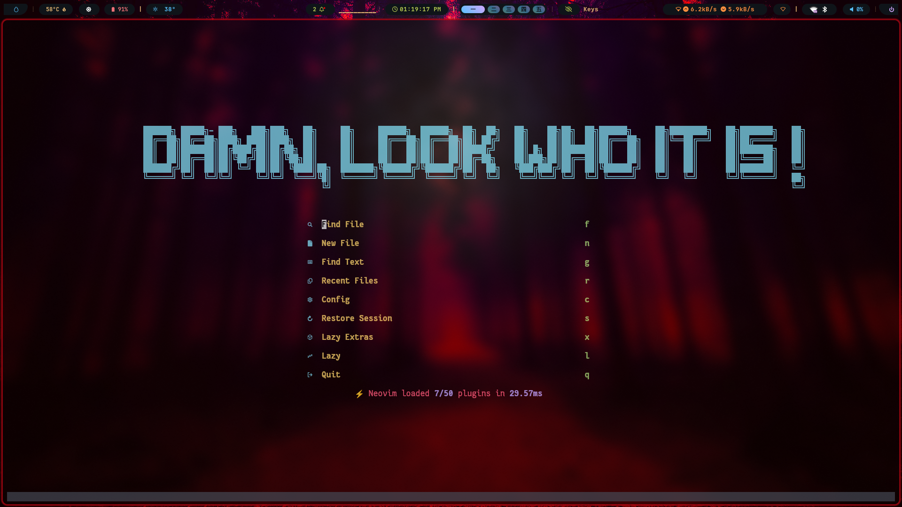
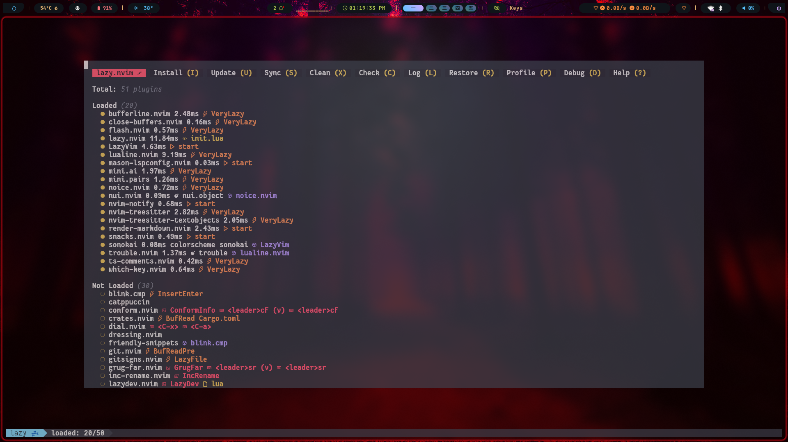

# Neovim dotfiles
## LazyVim based setup with 50+ plugins.




If you already have an existing configuration, make sure to back it up first.

```bash
mv ~/.config/nvim ~/.config/nvim-backup
```

Then, just copy it into your `.config` directory.

```bash
git clone https://github.com/xolboyev-1/neovim.git && cp -r neovim/nvim ~/.config/nvim
```
